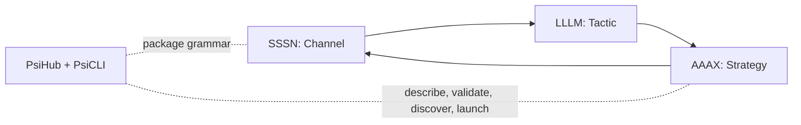

# Psi Documentation

Psi is a fractal connective grammar. It connects autonomous systems, composes them, and exposes the composite in the same shape it consumed, so the whole becomes a part and the loop recurs.

<a class="psi-tile" href="https://sssn.one/" markdown>
<strong>SSSN</strong>
Connect with `Channel`: how systems reach one another.
</a>

<a class="psi-tile" href="https://lllm.one/" markdown>
<strong>LLLM</strong>
Compose with `Tactic`: typed units of work that combine.
</a>

<a class="psi-tile" href="https://aaax.one/" markdown>
<strong>AAAX</strong>
Expose with `Strategy`: orchestration as a service-ready surface.
</a>

<a class="psi-tile" href="hub.md" markdown>
<strong>PsiHub</strong>
Describe, validate, discover, and download package metadata.
</a>

<a class="psi-tile" href="cli.md" markdown>
<strong>PsiCLI</strong>
Prepare credentials, inspect packages, and launch resources locally.
</a>

## Connect, Compose, Expose

The essence is: connect, compose, expose, then again. What gets exposed has the shape of what was connected, so composition can repeat at any level.

## One Shape

The docs are arranged as four switchable sets: `Psi`, `LLLM`, `SSSN`, and `AAAX`. The framework docs share the same public shape: one center abstraction, one thin implementation layer, and one service-ready surface.

The connective layer owns only the seam: no owned execution, no privileged coordinator. Thinness is what keeps the exposed composite self-similar to the connected part.

## Where To Go

- Use [SSSN](https://sssn.one/) when systems need to meet through channels, events, artifacts, snapshots, stores, or HTTP backends.
- Use [LLLM](https://lllm.one/) when typed tactics need to compose work across runtimes.
- Use [AAAX](https://aaax.one/) when composed package resources need to be exposed as CLI, FastAPI, or agentic shell surfaces.
- Use [PsiCLI](cli.md) when a human or local script needs to initialize credentials, inspect a package, or launch a package resource.
- Use [PsiHub](hub.md) when Python code needs package metadata, validation, local publish/download, cards, config templates, or local hub APIs.
- Use [Tutorial](tutorial.md) for the shortest package lifecycle.
- Use [Reference](reference.md) for the surface map across Psi, LLLM, SSSN, and AAAX.
