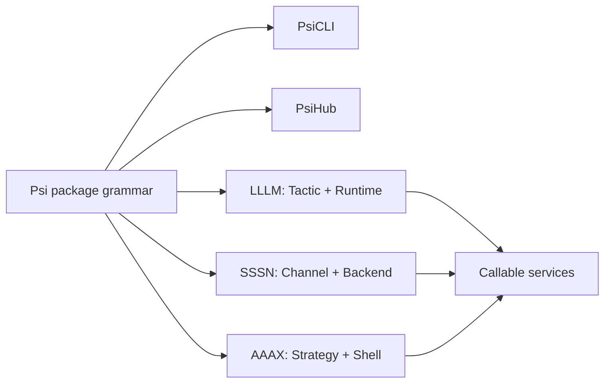

# Psi Documentation

Psi is the shared documentation set for the local command line, the package hub, and the flagship framework docs. It gives the user-facing setup story a MkDocs home, while the framework docs stay in their own sites.

<a class="psi-tile" href="cli.md" markdown>
<strong>PsiCLI</strong>
Prepare credentials, inspect package requirements, and launch package resources locally.
</a>

<a class="psi-tile" href="hub.md" markdown>
<strong>PsiHub</strong>
Validate, store, download, and render package metadata from Python.
</a>

<a class="psi-tile" href="https://lllm.one/" markdown>
<strong>LLLM</strong>
Low-Level Language Models centers the `Tactic` abstraction and runtime layer.
</a>

<a class="psi-tile" href="https://sssn.one/" markdown>
<strong>SSSN</strong>
Simple System of Systems Network centers the `Channel` abstraction and backend layer.
</a>

<a class="psi-tile" href="https://aaax.one/" markdown>
<strong>AAAX</strong>
Advanced Autonomous Agent Executor centers `Strategy` composition and shell surfaces.
</a>

## One Shape

The docs are arranged as four switchable sets: `Psi`, `LLLM`, `SSSN`, and `AAAX`. Each framework uses the same public shape: one framework, one center abstraction, one implementation layer, and one service-ready surface.

## Where To Go

- Use [PsiCLI](cli.md) when a human or local script needs to initialize credentials, inspect a package, or launch a package resource.
- Use [PsiHub](hub.md) when Python code needs package metadata, validation, local publish/download, cards, config templates, or local hub APIs.
- Use [Tutorial](tutorial.md) for the shortest package lifecycle.
- Use [Reference](reference.md) for the surface map across Psi, LLLM, SSSN, and AAAX.
